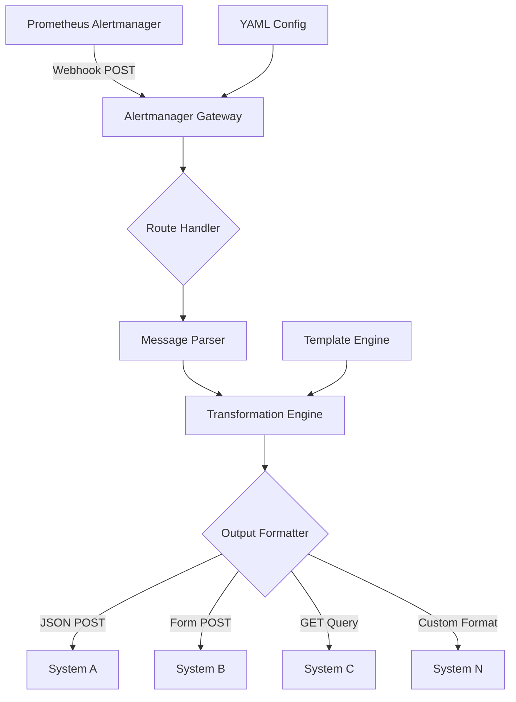
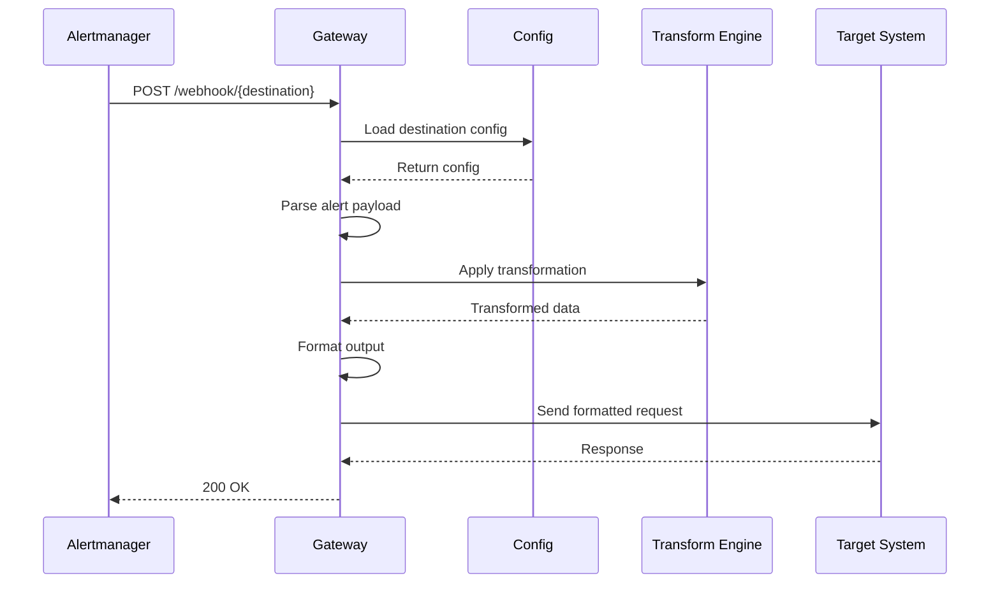
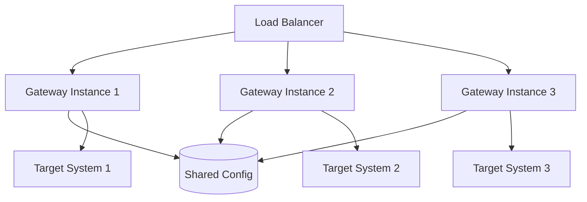

# Alertmanager Gateway Architecture

## Overview

The Alertmanager Gateway is a service that receives webhook notifications from Prometheus Alertmanager and transforms them into various formats required by third-party systems. It acts as a universal adapter between Alertmanager's webhook format and diverse external notification systems.

## System Architecture



## Core Components

### 1. HTTP Server
- Listens for incoming webhook requests from Alertmanager
- Routes requests based on URL path to different destination configurations
- Validates incoming webhook payloads

### 2. Route Handler
- Maps URL paths to destination configurations
- Example: `/webhook/slack` → Slack configuration
- Supports dynamic path-based routing

### 3. Message Parser
- Parses Alertmanager webhook JSON payload
- Extracts alert data including:
  - Alert name and status
  - Labels and annotations
  - Start/end times
  - Generator URL

### 4. Transformation Engine
- Applies templates to transform alert data
- Supports various template engines (Go templates)
- Allows field mapping, filtering, and custom logic
- Provides built-in functions for common transformations

### 5. Output Formatter
- Formats transformed data according to destination requirements:
  - **JSON**: For REST API endpoints
  - **Form-encoded**: For legacy systems
  - **Query parameters**: For GET requests
  - **Custom formats**: XML, plain text, etc.

### 6. HTTP Client
- Sends formatted requests to third-party systems
- Supports various HTTP methods (GET, POST, PUT, etc.)
- Handles authentication (Basic, Bearer, API keys)
- Implements retry logic and timeouts

## Data Flow



## Configuration Structure

```yaml
# config.yaml
server:
  host: "0.0.0.0"
  port: 8080
  read_timeout: 30s
  write_timeout: 30s

destinations:
  # Using Go template (default)
  # Webhook URL will be: /webhook/slack
  - name: "slack"
    method: "POST"
    url: "https://hooks.slack.com/services/XXX/YYY/ZZZ"
    headers:
      Content-Type: "application/json"
    format: "json"
    template: |
      {
        "text": "Alert: {{ .GroupLabels.alertname }}",
        "attachments": [
          {
            "color": "{{ if eq .Status \"resolved\" }}good{{ else }}danger{{ end }}",
            "fields": [
              {
                "title": "Status",
                "value": "{{ .Status }}",
                "short": true
              }
            ]
          }
        ]
      }
    
  # Using jq engine
  # Webhook URL will be: /webhook/slack-jq
  - name: "slack-jq"
    method: "POST"
    url: "https://hooks.slack.com/services/XXX/YYY/ZZZ"
    headers:
      Content-Type: "application/json"
    format: "json"
    engine: "jq"
    transform: |
      {
        text: ("Alert: " + .groupLabels.alertname),
        attachments: [{
          color: (if .status == "resolved" then "good" else "danger" end),
          fields: [{
            title: "Status",
            value: .status,
            short: true
          }]
        }]
      }
    
  - name: "custom-api"
    method: "POST"
    url: "https://api.example.com/alerts"
    headers:
      Authorization: "Bearer {{ .Env.API_TOKEN }}"
      Content-Type: "application/json"
    format: "json"
    template: |
      {
        "alert_id": "{{ .GroupKey }}",
        "severity": "{{ .CommonLabels.severity }}",
        "message": "{{ .CommonAnnotations.summary }}",
        "timestamp": "{{ .Alerts.StartsAt }}"
      }
    
  - name: "legacy-system"
    # Webhook URL will be: /webhook/legacy
    method: "POST"
    url: "https://legacy.example.com/alert"
    format: "form"
    template: |
      alert_name={{ .GroupLabels.alertname }}
      severity={{ .CommonLabels.severity }}
      message={{ .CommonAnnotations.summary | urlquery }}
    
  - name: "monitoring-tool"
    # Webhook URL will be: /webhook/monitor
    method: "GET"
    url: "https://monitor.example.com/api/alert"
    format: "query"
    template: |
      name={{ .GroupLabels.alertname }}
      status={{ .Status }}
      time={{ .Alerts.StartsAt | unixtime }}
```

## Template Engine Features

The gateway uses Go's text/template engine with custom functions. While it doesn't support jq directly, it provides similar functionality through custom template functions.

### Built-in Functions

#### String Manipulation
- `urlquery`: URL encode strings
- `base64`: Base64 encode
- `upper`/`lower`: Case conversion
- `replace`: String replacement (e.g., `{{ .Message | replace "old" "new" }}`)
- `truncate`: Limit string length
- `trim`: Remove whitespace
- `split`: Split string into array
- `join`: Join array elements with separator

#### JSON/Data Manipulation (jq-like functions)
- `json`: JSON encode objects
- `jsonPath`: Extract values using JSON path (e.g., `{{ .Data | jsonPath "$.alerts[0].labels" }}`)
- `select`: Filter array elements (e.g., `{{ .Alerts | select "severity" "critical" }}`)
- `map`: Transform array elements
- `filter`: Filter based on conditions
- `first`/`last`: Get first/last element from array
- `index`: Access array element by index
- `keys`: Get object keys
- `values`: Get object values
- `merge`: Merge objects
- `default`: Provide default value if empty

#### Time Functions
- `unixtime`: Convert time to Unix timestamp
- `formatTime`: Format time with custom layout
- `now`: Current timestamp
- `parseTime`: Parse time string

#### Conditional Functions
- `if`/`else`: Conditional logic
- `eq`/`ne`/`lt`/`gt`: Comparison operators
- `and`/`or`/`not`: Logical operators
- `contains`: Check if string contains substring
- `hasKey`: Check if object has key

### Complex Template Examples

#### Example 1: Filtering Critical Alerts Only
```yaml
template: |
  {
    "alerts": [
      {{ range $i, $alert := .Alerts }}
        {{ if eq $alert.Labels.severity "critical" }}
          {{ if $i }},{{ end }}
          {
            "name": "{{ $alert.Labels.alertname }}",
            "instance": "{{ $alert.Labels.instance }}",
            "message": "{{ $alert.Annotations.summary }}"
          }
        {{ end }}
      {{ end }}
    ]
  }
```

#### Example 2: Extracting Specific Fields (jq-like)
```yaml
template: |
  {
    "notification": {
      "title": "{{ .GroupLabels.alertname }}",
      "alerts": {{ .Alerts | map "Labels.instance" | json }},
      "critical_count": {{ .Alerts | select "Labels.severity" "critical" | len }},
      "first_instance": {{ .Alerts | first | jsonPath "$.labels.instance" | default "unknown" }}
    }
  }
```

#### Example 3: Dynamic Field Selection
```yaml
template: |
  {
    {{ range $key, $value := .CommonLabels }}
      {{ if contains $key "app_" }}
        "{{ $key | replace "app_" "" }}": "{{ $value }}",
      {{ end }}
    {{ end }}
    "alert_count": {{ .Alerts | len }},
    "status": "{{ .Status }}"
  }
```

#### Example 4: Nested Data Transformation
```yaml
template: |
  {
    "service_alerts": {
      {{ range $service, $alerts := .Alerts | groupBy "Labels.service" }}
        "{{ $service }}": {
          "count": {{ $alerts | len }},
          "severities": {{ $alerts | map "Labels.severity" | unique | json }},
          "instances": {{ $alerts | map "Labels.instance" | json }}
        }{{ if not (last $service) }},{{ end }}
      {{ end }}
    }
  }
```

### Using Embedded jq (gojq) for Transformations

The gateway supports embedded jq transformations using the gojq library (github.com/itchyny/gojq), providing full jq language support without external dependencies.

#### Configuration with jq Engine

```yaml
destinations:
  - name: "slack-jq"
    # Webhook URL will be: /webhook/slack
    method: "POST"
    url: "https://hooks.slack.com/services/XXX"
    format: "json"
    engine: "jq"  # Use jq instead of go-template
    transform: |
      {
        text: ("Alert: " + .groupLabels.alertname),
        attachments: [
          {
            color: (if .status == "resolved" then "good" else "danger" end),
            fields: [
              {
                title: "Status",
                value: .status,
                short: true
              },
              {
                title: "Severity",
                value: .commonLabels.severity,
                short: true
              }
            ],
            text: (.alerts | map(.annotations.summary) | join("\n"))
          }
        ]
      }

  - name: "custom-api-jq"
    # Webhook URL will be: /webhook/custom
    method: "POST"
    url: "https://api.example.com/alerts"
    format: "json"
    engine: "jq"
    transform: |
      .alerts
      | map(select(.labels.severity == "critical" or .labels.severity == "warning"))
      | map({
          id: .fingerprint,
          name: .labels.alertname,
          severity: .labels.severity,
          instance: .labels.instance,
          message: .annotations.summary,
          runbook: .annotations.runbook_url,
          timestamp: .startsAt
        })

  - name: "aggregated-alerts"
    # Webhook URL will be: /webhook/aggregate
    method: "POST"
    url: "https://monitoring.example.com/bulk"
    format: "json"
    engine: "jq"
    transform: |
      {
        notification_id: .groupKey,
        status: .status,
        alert_count: (.alerts | length),
        by_severity: (
          .alerts
          | group_by(.labels.severity)
          | map({
              severity: .[0].labels.severity,
              count: length,
              instances: map(.labels.instance) | unique
            })
        ),
        critical_alerts: (
          .alerts
          | map(select(.labels.severity == "critical"))
          | map(.labels.alertname)
          | unique
        ),
        start_time: (.alerts | map(.startsAt) | sort | first),
        services_affected: (.alerts | map(.labels.service // "unknown") | unique)
      }
```

#### Hybrid Mode: Combining Go Templates and jq

For complex scenarios, you can use both engines:

```yaml
destinations:
  - name: "hybrid-transform"
    # Webhook URL will be: /webhook/hybrid
    method: "POST"
    url: "{{ .Env.WEBHOOK_URL }}"  # Go template for URL
    format: "json"
    # First apply jq transformation
    engine: "jq"
    transform: |
      {
        alerts: (.alerts | map({
          name: .labels.alertname,
          severity: .labels.severity,
          tags: (.labels | to_entries | map(select(.key | startswith("tag_")) | {key: (.key[4:]), value})
                | from_entries)
        })),
        metadata: {
          total: (.alerts | length),
          critical: (.alerts | map(select(.labels.severity == "critical")) | length)
        }
      }
    # Then apply Go template for final formatting
    post_template: |
      {
        "webhook_version": "1.0",
        "timestamp": "{{ now | formatTime "2006-01-02T15:04:05Z07:00" }}",
        "data": {{ .TransformedData | json }}
      }
```

#### Advanced jq Examples

##### Complex Filtering and Grouping
```yaml
engine: "jq"
transform: |
  {
    summary: {
      total_alerts: (.alerts | length),
      active_since: (.alerts | map(.startsAt) | sort | first),
      grouped_by_service: (
        .alerts
        | group_by(.labels.service)
        | map({
            service: .[0].labels.service,
            alerts: map({
              name: .labels.alertname,
              severity: .labels.severity,
              instance: .labels.instance
            })
          })
      )
    },
    high_priority: (
      .alerts
      | map(select(.labels.severity == "critical" or 
                   (.labels.severity == "warning" and .labels.tier == "1")))
      | sort_by(.startsAt)
    )
  }
```

##### Dynamic Field Mapping
```yaml
engine: "jq"
transform: |
  .alerts | map({
    # Map standard fields
    id: .fingerprint,
    title: .labels.alertname,
    severity: .labels.severity,
    
    # Dynamically include all annotations
    details: .annotations,
    
    # Extract custom labels with prefix
    custom_fields: (
      .labels
      | to_entries
      | map(select(.key | startswith("custom_")))
      | map({key: (.key[7:]), value: .value})
      | from_entries
    ),
    
    # Calculate duration if resolved
    duration: (
      if .endsAt != "0001-01-01T00:00:00Z" then
        (.endsAt | fromdateiso8601) - (.startsAt | fromdateiso8601)
      else null end
    )
  })
```

##### Conditional Transformations
```yaml
engine: "jq"
transform: |
  if .status == "firing" then
    {
      urgency: (
        if any(.alerts[]; .labels.severity == "critical") then "immediate"
        elif any(.alerts[]; .labels.severity == "warning") then "high"
        else "normal" end
      ),
      alerts: .alerts,
      escalation_required: any(.alerts[]; 
        .labels.severity == "critical" and 
        (now - (.startsAt | fromdateiso8601)) > 300
      )
    }
  else
    {
      resolved: true,
      resolution_time: .alerts[0].endsAt,
      total_duration: (
        .alerts 
        | map(((.endsAt | fromdateiso8601) - (.startsAt | fromdateiso8601)))
        | max
      )
    }
  end
```

### Splitting Grouped Alerts

Alertmanager groups alerts by default, but some destination systems require individual notifications. The gateway supports splitting grouped alerts into separate requests.

#### Configuration for Alert Splitting

```yaml
destinations:
  # Split alerts and send individually
  - name: "ticketing-system"
    # Webhook URL will be: /webhook/tickets
    method: "POST"
    url: "https://tickets.example.com/api/create"
    format: "json"
    split_alerts: true  # Send each alert as a separate request
    engine: "jq"
    transform: |
      {
        title: .labels.alertname,
        description: .annotations.summary,
        severity: .labels.severity,
        source: .labels.instance,
        alert_id: .fingerprint,
        started_at: .startsAt,
        status: $status,  # Parent status passed as variable
        group_key: $groupKey  # Parent group key for correlation
      }

  # Split with batching
  - name: "sms-gateway"
    # Webhook URL will be: /webhook/sms
    method: "POST"
    url: "https://sms.example.com/send"
    format: "json"
    split_alerts: true
    batch_size: 10  # Send up to 10 alerts per request
    engine: "jq"
    transform: |
      {
        recipients: .labels.oncall_phone // "+1234567890",
        message: (
          "[" + .labels.severity + "] " + 
          .labels.alertname + " on " + 
          .labels.instance + ": " + 
          (.annotations.summary | .[0:140])  # SMS length limit
        )
      }

  # Conditional splitting based on labels
  - name: "mixed-handler"
    # Webhook URL will be: /webhook/mixed
    method: "POST"
    url: "https://api.example.com/alerts"
    format: "json"
    split_mode: "conditional"
    split_condition: '.labels.split == "true"'  # Only split if label exists
    engine: "jq"
    transform: |
      if $split then
        # Individual alert format
        {
          alert: {
            id: .fingerprint,
            name: .labels.alertname,
            details: .annotations
          }
        }
      else
        # Grouped format
        {
          group: $groupKey,
          alerts: $alerts | map({id: .fingerprint, name: .labels.alertname})
        }
      end
```

#### Advanced Splitting Strategies

##### Split by Severity
```yaml
destinations:
  - name: "severity-router"
    # Webhook URL will be: /webhook/route
    split_strategy: "by_field"
    split_field: "labels.severity"
    routes:
      critical:
        url: "https://pagerduty.example.com/critical"
        format: "json"
        transform: |
          {
            routing_key: .labels.service,
            event_action: "trigger",
            payload: {
              summary: .annotations.summary,
              severity: "critical",
              source: .labels.instance
            }
          }
      warning:
        url: "https://slack.example.com/warnings"
        format: "json"
        transform: |
          {
            text: "⚠️ Warning: " + .annotations.summary,
            channel: "#alerts-warning"
          }
```

##### Smart Batching
```yaml
destinations:
  - name: "email-batch"
    # Webhook URL will be: /webhook/email
    method: "POST"
    url: "https://email.example.com/send"
    split_alerts: true
    batch_strategy: "smart"
    batch_config:
      max_size: 50
      group_by: ["labels.team", "labels.service"]
      time_window: "5m"
    engine: "jq"
    transform: |
      {
        to: (.labels.team + "@example.com"),
        subject: (
          "Alerts for " + .labels.service + 
          " (" + ($batch_size | tostring) + " alerts)"
        ),
        body: (
          $alerts | map(
            "• [" + .labels.severity + "] " + 
            .labels.alertname + " - " + 
            .annotations.summary
          ) | join("\n")
        )
      }
```

##### Parallel Processing
```yaml
destinations:
  - name: "parallel-processor"
    # Webhook URL will be: /webhook/parallel
    split_alerts: true
    parallel_requests: 5  # Process up to 5 alerts simultaneously
    retry_policy:
      max_attempts: 3
      backoff: "exponential"
    engine: "jq"
    transform: |
      {
        incident: {
          id: .fingerprint,
          title: .labels.alertname,
          description: .annotations.description,
          impact: (
            if .labels.severity == "critical" then "high"
            elif .labels.severity == "warning" then "medium"
            else "low" end
          ),
          affected_services: (
            [.labels.service] + 
            (.labels | to_entries | map(select(.key | startswith("dependency_")) | .value))
          )
        }
      }
```

#### Split Alert Variables

When splitting alerts, additional variables are available in templates:

- `$status`: Original group status (firing/resolved)
- `$groupKey`: Original group key for correlation
- `$groupLabels`: Common labels from the group
- `$receiver`: Original receiver name
- `$externalURL`: Alertmanager external URL
- `$alerts`: Full array of alerts (in split mode, current alert)
- `$index`: Current alert index in the group
- `$total`: Total number of alerts in the group
- `$batch_size`: Number of alerts in current batch
- `$split`: Boolean indicating split mode

#### Use Cases for Alert Splitting

1. **Ticketing Systems**: Create individual tickets for each alert
2. **SMS/Phone Notifications**: Send concise individual messages
3. **Legacy APIs**: Systems that don't support bulk operations
4. **Compliance Requirements**: Individual audit trails per alert
5. **External API Limitations**: Control request frequency by splitting

### Creating Custom jq-like Templates

If you need jq-like functionality with the current Go template system, you can:

1. **Use JSONPath expressions**:
```yaml
template: |
  {{ $criticalAlerts := .Alerts | jsonPath "$[?(@.labels.severity=='critical')]" }}
  {{ $criticalAlerts | json }}
```

2. **Chain multiple functions**:
```yaml
template: |
  {{ .Alerts | select "Labels.severity" "warning" | map "Labels.instance" | unique | join "," }}
```

3. **Use conditional aggregation**:
```yaml
template: |
  {
    "summary": {
      "total": {{ .Alerts | len }},
      "by_severity": {
        {{ range $sev := list "critical" "warning" "info" }}
          "{{ $sev }}": {{ $.Alerts | select "Labels.severity" $sev | len }}{{ if not (last $sev) }},{{ end }}
        {{ end }}
      }
    }
  }
```

### Template Variables
- `.Status`: Alert status (firing/resolved)
- `.GroupLabels`: Common labels across grouped alerts
- `.CommonLabels`: Labels common to all alerts
- `.CommonAnnotations`: Annotations common to all alerts
- `.Alerts`: Array of individual alerts
- `.ExternalURL`: Alertmanager external URL
- `.GroupKey`: Unique identifier for alert group
- `.Env`: Environment variables access

## Security Considerations

### Network Security
The gateway provides secure communication through:

- TLS support for incoming connections
- Certificate validation for outbound requests
- Configurable timeouts to prevent hanging connections

### Destination Authentication
- Support for various authentication methods per destination
- Secure storage of credentials using environment variables
- API key rotation support

### Input Validation
- Validate incoming Basic Auth credentials
- Sanitize template outputs to prevent injection
- Request size limits

### Network Security
- TLS support for incoming connections
- Certificate validation for outbound requests
- Configurable timeouts to prevent hanging connections

## High Availability



### Deployment Patterns

1. **Stateless Design**: No persistent state enables horizontal scaling
2. **Configuration Management**: 
   - File-based configuration with environment variable support
   - Configuration validation on startup prevents runtime errors
3. **Health Checks**: Multiple endpoints for different types of monitoring

## Monitoring and Observability

### Metrics (Prometheus)
- Request rate per destination
- Success/failure rates
- Request duration histograms
- Template rendering time
- Outbound request latency

### Logging
- Structured logging with Logrus
- Request/response logging
- Error tracking with context
- Audit trail for configuration changes

### Tracing
- Distributed tracing support
- Request correlation IDs
- End-to-end latency tracking

## Error Handling

### Retry Logic
```yaml
destinations:
  - name: "example"
    retry:
      max_attempts: 3
      backoff: "exponential"
      initial_delay: "1s"
      max_delay: "30s"
```

### Failure Modes
1. **Destination Unreachable**: Log error, return 502 to Alertmanager
2. **Template Error**: Log error, return 500
3. **Invalid Configuration**: Fail fast on startup
4. **Request Overload**: Queue or drop based on configuration

## Performance Considerations

### Request Processing
- Concurrent request handling
- Connection pooling for outbound requests
- Template caching for performance
- Configurable worker pool size

### Resource Management
- Memory limits for template rendering
- CPU throttling under high load
- Graceful shutdown handling

## Extension Points

### Custom Transformers
- Plugin system for custom transformation logic
- Support for external template functions
- WebAssembly support for sandboxed transformations

### Output Adapters
- Pluggable output formats
- Custom protocol support
- Batch processing capabilities