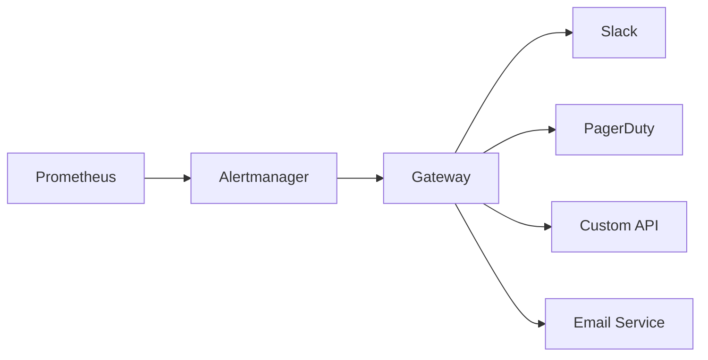

# Alertmanager Gateway

A flexible and powerful gateway service that receives webhook notifications from Prometheus Alertmanager and transforms them into various formats required by third-party notification systems.

## Key Features

- **Universal Format Support**: Convert Alertmanager webhooks to JSON, Form-encoded, Query parameters, or custom formats
- **Flexible Routing**: Path-based routing to multiple destinations
- **Template Engine**: Powerful templating system for message transformation
- **Multiple Destinations**: Support unlimited notification endpoints
- **High Availability**: Stateless design for horizontal scaling
- **Security**: Built-in authentication and secure credential management
- **Observability**: Prometheus metrics and structured logging

## Quick Start

### Installation

```bash
# Using Docker
docker run -d \
  -p 8080:8080 \
  -v $(pwd)/config.yaml:/config.yaml \
  alertmanager-gateway:latest

# Using Go
go install github.com/vitalvas/alertmanager-gateway/cmd/gateway@latest
```

### Basic Configuration

Create a `config.yaml` file:

```yaml
server:
  host: "0.0.0.0"
  port: 8080
  auth:
    enabled: true
    username: "alertmanager"
    password: "${GATEWAY_PASSWORD}"  # Set via environment variable

destinations:
  - name: "slack"
    # Webhook URL will be: /webhook/slack
    method: "POST"
    url: "https://hooks.slack.com/services/YOUR/WEBHOOK/URL"
    format: "json"
    headers:
      Content-Type: "application/json"
    template: |
      {
        "text": "Alert: {{ .GroupLabels.alertname }}",
        "attachments": [{
          "color": "{{ if eq .Status \"resolved\" }}good{{ else }}danger{{ end }}",
          "text": "{{ .CommonAnnotations.summary }}"
        }]
      }
```

### Configure Alertmanager

Add the gateway as a webhook receiver in your Alertmanager configuration:

```yaml
receivers:
  - name: 'gateway-slack'
    webhook_configs:
      - url: 'http://alertmanager-gateway:8080/webhook/slack'
        send_resolved: true
        http_config:
          basic_auth:
            username: 'alertmanager'
            password: 'your-password'
```

## Architecture Overview



The gateway acts as a universal adapter, receiving standardized webhook payloads from Alertmanager and transforming them into the specific formats required by various notification services.

## Use Cases

- **Multi-Channel Notifications**: Send alerts to Slack, Teams, Discord, and custom systems
- **Legacy System Integration**: Convert modern webhook formats to legacy API requirements
- **Alert Enrichment**: Add custom fields or transform data before forwarding
- **Security Gateway**: Centralize authentication and API key management
- **Alert Routing**: Route different alerts to different systems based on labels

## Next Steps

- Read the [Architecture Documentation](architecture.md) to understand the system design
- Check the [API Reference](api.md) for endpoint details
- Follow the [Deployment Guide](deployment.md) for production setup